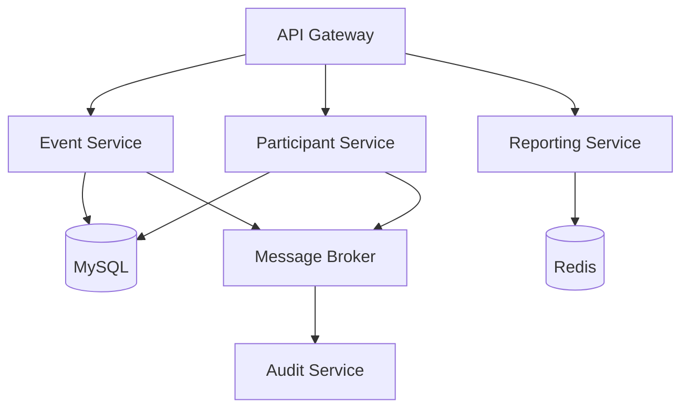
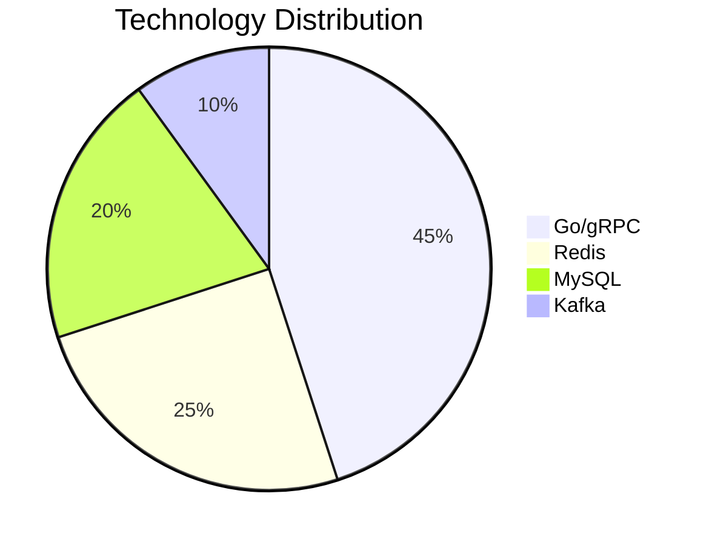

[-] Возможность администратору добавлять людей на событие
[] Нужно сделать регистриацию для волонтеров и отдельно хранить даннные о них и выводить ID записавшего в информации о записях человека
[] Предстоящие мероприятия и история, чтобы напоминать на когда записан человек и говорить что он пропустил что-то
[] Первое открывается доступные услуги
[-] Добавить участника на событие админу
[-] Выбор нескольких мероприятий
[-] Сделать выбор нескольикх участников для изменений статуса
[-] Посетители убираем и добавлякем поиск по участникам среди мероприятий
[] Потестировать календарь с 8+ событий
[] Нужно добавить сущность событие и добавлять в него услуги. Вместимость есть как на событие, так и на услуги. Событие привязано к месту, а услуга - к человеку. Если у человека есть хотя бы одна услуга - он добавляется в событие и дальше смотрится только на ограничение о кол-ву людей на услугах

Требования:
1.
Изменение логики добавления мероприятий администратором
Администратор будет создавать не просто мероприятия, которые представляют из себя услуги, а события, в рамках которых оказывается несколько услуг. События привязаны ко дню и к месту, которые можно задать при создании, и они отображаются списком. Также, по ним задается максимальное количество участников. В рамках каждого события может быть добавлено несколько услуг, каждая из которых уже првязана к определенному времени и для которой также задается кол-во мест (меньше либо равное макс.кол-ву мест на событие) и окно бронирования (на сколько событий впееред можно записаться на данную услугу).
Если у человека есть запись хотя бы на одну услугу, которая оказывается в рамках какого-то события - он считается участником данног события, суммарное количество участнкиов события не может превышать заданное максимальное.
Для волонтера запись остается прежней - он записывает на услуги из МКС, которые "внутри" привязаны к событиям. календарь мероприятия (услуг) для просмотра администратором нужно оставить.

Таким образом, изменения в Интерфейсе Расписание следующие:
- Создание, редактирование и отображение событий выносится в отдельную вкладку, они должны отображаться карточками или удобным списком с базовой фильтрацией. При создании события нужно задать: название, день, вместимость, место, которое можно выбрать из списка или создать новое, список формуируется из созданных раннее мест. Обязательно нужно иметь возможность добавить услуги, которые будут оказываться на событии. По каждой из услуг необходимо выбрать время, тип, вместимость, окно для бронирования, которое представляет из себя максимальное количество дней вперед, на которое можно записаться на услугу, по аналогии с мероприятиями (вспомни про тот пример с 28 фераля), Также, при создании места нужно иметь возможность гибко настраивать его периодичность, по аналогии с тем, как это сейчас реализовано в мерпориятиях, только не нужно задавать окно бронирования.

- Нужно учитывать, что события бывают двух типов: повторяющиеся и разовые. Обязательно нужно иметь возможность задать парметры для повторения события: Frequency (daily/weekly/monthly) End date (optional) or "Repeat Indefinitely" checkbox. При создании события мы указываем дату первого события. Для повторящюхся событий - не нужно выводить дату в списке событий.
- При фильтрации событий нужно иметь возможность выбрать не только конкретную даты, но и диапазон дат
- Должна быть вкладка не только с активными событиями, но и с архивными. Разовые события автоматически переходят в архив, когда их дата становится больше текущей, а повторяющиеся события должна быть возможность перенести в арихив. События из архива должны визуально отличаться.
- При добавлении услуги - должен быть только выбор услуг из списка, администратор не может создавать новые услуги.
- Кнопки редактировать и удалить событие должны быть адаптивными для мобильных устройств и менять расположение, чтобы вписываться в блок события
- Еще раз нужно акцентировать внимание на том, что необходимо убрать полностью вкладку посетители


Все эти изменения создают интуитивный интерфейс для администраторов, позволяющий эффективно управлять как разовыми, так и повторяющимися событиями, фильтровать их по различным параметрам и работать с услугами.


2. Добавление функционала для работы с участниками мероприятия
Нужно предоставить администратору возможность добавить человека на мероприятие в модальном окне просмотра участников мероприятия. Оно должно выводить предупреждение, если администратор пытается добавить участника, когда достигнуто максимальное количество участников. (количество участников равно вместимости)
Также, нужно дать возможность изменить статус сразу нескольким участникам. Должен быть чек-бокс, позволяющий выбрать участника и кнопка для того, чтобы изменить статус участника.
Помимо этого, нужно добавить фильтр мероприятий по участнику мероприятия, то есть - поисковая строка, в которой можно вбить ID или фамилию и имя человека и тогда в списке мероприятий останутся только те мероприятия, участником которого является человек.
Еще нужно добавить возможность редактировать мероприятие: изменить время, вместимость. При удалении мероприятия, если на него записаны люди, нужно вывести предупреждение, сообщающее о том, что на него уже записаны люди.


3.
- Убери вкладку карточки из раздела Управление расписанием, меня устраивает отображение в таблице
- Нужно вернуть возможность создать место проведения события при создании события. То есть - при создании события выбираем место, если нужного нет - создаем
- Нужно добавить филтр событий по услуге, которая на нем оказывается. Услугу нужно выбрать из выпадающего списка.
- Должна быть кнопка активировать для события в архиве. Для повторящюхся событий - они должны преместиться в блок активные, а для разовых - нужно указать дату события при нажатии а кнопку активировать, чтобы в активных не оказались события с датой меньше, чем текущая 

Критическая доработка: не отображаются примеры событий и мероприятий в разделах раписание и мероприятия.

4.
Сейчас работает только с разделом управление мероприятими, остальное меня полностью устраивает.

- Убери фильтр по диапазону дат в списке мероприятий и убери фильтр по статусу, У мероприятий нет статуса. Также, нужно добавить фильтрацию событий по месту мерпориятия.
- В прошедших мерпориятиях должны мерпорияти у которых дата которых раньше, чем текущая, они попадют туда автоматически
- Поля в списке мероприятий должны быть следующие: название, дата и время (дата берется из события), место (берется из события), участники, 
- Не отображается место и участники мероприятий в списке мероприятия, нужно испарвить это
- Не работает кнопка редактирования мероприятия, нужно исправить это и добавить возможность изменять время и вместимость
- Проверь целлостность данных по данной вкладке, ее функционал нарушен, данные не отображаются корректно, исправь ошибки


### Функциональные требования сервиса  
---

#### **1. Управление событиями (вкладка "Расписание")**

1.1. **Просмотр событий**
- Разделение на вкладки:
  - "Активные" - текущие и будущие события
  - "Архивные" - прошедшие события
- Отображение в двух форматах:
  - Таблица для десктопной версии
  - Карточки для мобильной версии
- Отображение количества событий для каждой вкладки

1.2. **Создание события**
- Доступ через:
  - Кнопку "Создать событие" в шапке (десктоп)
  - FAB-кнопку в правом нижнем углу (мобильная версия)
- Обязательные поля:
  - Название события
  - Дата и время
  - Тип (разовое/повторяющееся)
  - Место проведения
  - Максимальное количество участников
- Для повторяющихся событий:
  - Частота (ежедневно/еженедельно/ежемесячно)
  - Интервал повторения
  - Окончание (бессрочно/количество повторений/дата)
- Настройка услуг:
  - Выбор из предустановленных типов
  - Указание времени проведения
  - Установка вместимости
  - Настройка окна бронирования

1.3. **Фильтрация и поиск**
- Поисковая строка для фильтрации по:
  - Названию события
  - Месту проведения
- Расширенные фильтры:
  - Диапазон дат (с календарем)
  - Тип события (все/разовые/повторяющиеся)
  - Услуга (выбор из списка доступных)
- Возможность сброса всех фильтров

1.4. **Управление событиями**
- Действия для активных событий:
  - Редактирование
  - Архивация
  - Удаление
- Действия для архивных событий:
  - Активация (с выбором новой даты для разовых событий)
  - Удаление
- Подтверждение для критических операций:
  - Удаление события
  - Архивация события с участниками

1.5. **Автоматизация**
- Автоматическое архивирование разовых событий после даты проведения
- Сохранение состояния фильтров при переключении вкладок
- Адаптивное отображение для разных устройств

1.6. **Места проведения**
- Предустановленные локации:
  - Цветной
  - Гиляровского
  - Ясная
- Возможность добавления новых мест при создании события

1.7. **Услуги**
- Предустановленные типы услуг из МКС:
  - Название (вместимость: _, окно: _ дней)

---

#### **1. Управление мероприятиями**
1.1. **Просмотр мероприятий**
- Разделение на "Предстоящие" и "Прошедшие" мероприятия
- Отображение в виде списка с колонками:
  - Название мероприятия
  - Дата и время
  - Место
  - Количество участников (текущее/максимальное)
  - Действия

1.2. **Фильтрация мероприятий**
- По типу услуги 
- По месту проведения 
- По участнику 

1.3. **Редактирование мероприятия**
- Возможность изменить только:
  - Время проведения
  - Вместимость (с проверкой: новая вместимость ≥ текущего числа участников)
- Отображение неизменяемых полей (название, место, тип) в режиме просмотра

1.4. **Удаление мероприятия**
- Запрет на удаление при наличии зарегистрированных участников
- Подтверждение действия через диалоговое окно

---

#### **2. Управление участниками**
2.1. **Просмотр участников**
- Отображение в виде таблицы с колонками:
  - ФИО
  - Телефон
  - Статус (Присутствовал/Не пришел/Ожидается)
- Отображение общего количества участников и максимальной вместимости

2.2. **Добавление участника**
- Поиск по ФИО, ID или телефону с автодополнением
- Проверка на:
  - Превышение вместимости мероприятия
  - Повторную регистрацию одного участника
- FAB-кнопка с иконкой "+" в правом нижнем углу

2.3. **Управление статусами**
- Групповое изменение статуса через чекбоксы
- Доступные статусы:
  - Присутствовал (зеленый)
  - Не пришел (красный)
  - Ожидается (желтый)

---

#### **3. Экспорт данных**
3.1. **Настройка экспорта**
- Выбор полей для экспорта:
  - Тип мероприятия
  - Дата мероприятия
  - Имя участника
  - Телефон
  - Статус
- Фильтрация по:
  - Типу мероприятия
  - Статусу участника
  - Периоду мероприятий
  - Периоду регистрации

3.2. **Форматы экспорта**
- Excel
- Печатная форма
- Предварительный просмотр данных

---

### Основные сценарии использования (юзкейсы)

#### 1. Управление расписанием мероприятий
**Актор**: Администратор
**Цель**: Просмотр и управление календарем мероприятий
**Шаги**:
1. Перейти в раздел "Расписание"
2. Использовать фильтры для поиска мероприятий:
   - По названию: "Медицинская консультация"
   - По месту: "Цветной", "Гиляровского", "Ясная"
   - По типу услуги: медицинская помощь, выдача одежды и т.д.
3. Просмотреть детали мероприятия:
   - Название: "Медицинская консультация"
   - Дата: 10.03.2025 10:00
   - Место: Цветной
   - Вместимость: 15 человек
   - Статус: активное/архивное

#### 2. Управление мероприятиями
**Актор**: Администратор
**Цель**: Управление текущими мероприятиями и участниками
**Шаги**:
1. Перейти в раздел "Мероприятия"
2. Выбрать вкладку:
   - "Предстоящие мероприятия"
   - "Прошедшие мероприятия"
   - "Экспорт данных"
3. Просмотреть список мероприятий с информацией:
   - Название мероприятия
   - Дата и время проведения
   - Место проведения
   - Количество участников (например: 5/10)

#### 3. Управление участниками мероприятия
**Актор**: Администратор
**Цель**: Добавление и управление участниками мероприятия
**Шаги**:
1. Открыть модальное окно управления участниками
2. Просмотреть текущий список (пример):
   - Виктор Толстихин (присутствовал)
   - Анна Петрова (не явилась)
   - Сергей Иванов (ожидается)
3. Добавить нового участника через FAB-кнопку:
   - Поиск по ФИО/ID
   - Проверка на превышение вместимости
   - Подтверждение добавления


#### 5. Экспорт данных
**Актор**: Администратор
**Цель**: Выгрузка данных о мероприятиях и участниках
**Шаги**:
1. Перейти на вкладку "Экспорт данных"
2. Настроить параметры выгрузки:
   - Тип мероприятия
   - Период дат
   - Статус участников
3. Выбрать поля для экспорта:
   - Данные мероприятия (название, дата, место)
   - Данные участников (ФИО, статус)
4. Выгрузить данные в выбранном формате

#### 6. Редактирование мероприятия
**Актор**: Администратор
**Цель**: Изменение параметров существующего мероприятия
**Шаги**:
1. Выбрать мероприятие из списка
2. Отредактировать доступные параметры:
   - Время проведения
   - Вместимость (с проверкой на текущее количество участников)
3. Сохранить изменения или отменить

#### 7. Управление статусами участников
**Актор**: Администратор
**Цель**: Отметка присутствия/отсутствия участников
**Шаги**:
1. Открыть список участников мероприятия
2. Выбрать участников через чекбоксы
3. Изменить статус на:
   - "Присутствовал"
   - "Не пришел"
   - "Ожидается"
4. При необходимости добавить комментарий

---

### Нефункциональные требования  
- **Производительность**: Загрузка списка событий ≤ 2 сек.  
- **Безопасность**: Ролевой доступ (только администраторы).  
- **Адаптивность**: Поддержка мобильных устройств с экраном ≥ 320px.  
- **Надежность**: Ежедневное резервное копирование данных.  


### Функциональные требования для системы записи посетителей

#### 1. Аутентификация и регистрация
- Разделение на новых и существующих посетителей
- Поиск существующих посетителей по:
  - Номеру карты
  - Фамилии
- Регистрация новых посетителей с полями:
  - Имя (обязательное, минимум 2 символа)
  - Фамилия (обязательное, минимум 2 символа)
  - Телефон (опциональное, формат +7 (XXX) XXX-XX-XX)
  - Комментарий (опциональное)

#### 2. Профиль посетителя
- Отображение основной информации:
  - ФИО
  - Номер карты
  - Фотография (аватар)
- Разделы профиля:
  - История записей
  - Доступные услуги
  - Мои мероприятия (активные и прошедшие)

#### 3. Управление записями
- Просмотр доступных услуг с описанием
- Фильтрация по локациям:
  - Цветной
  - Гиляровского
  - Ясная
- Статусы записей:
  - Запланировано
  - Выполнено
  - Не явился

#### 4. Система бронирования
- Календарь с доступными датами
- Выбор временных слотов
- Добавление комментария к записи
- Подтверждение бронирования

### Основные юзкейсы

#### 1. Вход существующего посетителя
**Актор**: Посетитель
**Цель**: Войти в систему
**Шаги**:
1. Открыть главную страницу
2. Выбрать "Зарегистрированный посетитель"
3. Ввести номер карты или фамилию
4. Перейти в профиль

#### 2. Регистрация нового посетителя
**Актор**: Посетитель
**Цель**: Создать новый профиль
**Шаги**:
1. Выбрать "Новый посетитель"
2. Заполнить обязательные поля:
   - Имя
   - Фамилия
3. Опционально заполнить:
   - Телефон
   - Комментарий
4. Подтвердить регистрацию

#### 3. Запись на услугу
**Актор**: Посетитель
**Цель**: Забронировать время для получения услуги
**Шаги**:
1. Перейти в раздел "Доступные услуги"
2. Выбрать услугу (например, "Стирка (Цветной)")
3. Выбрать дату из доступных
4. Выбрать временной слот
5. Добавить комментарий (при необходимости)
6. Подтвердить запись

#### 4. Управление записями
**Актор**: Посетитель
**Цель**: Просмотр и управление существующими записями
**Шаги**:
1. Открыть раздел "История записей"
2. Просмотреть:
   - Дату и время
   - Название услуги
   - Статус
3. Возможные действия:
   - Отметить неявку
   - Добавить комментарий
   - Отменить запись

#### 5. Управление мероприятиями
**Актор**: Посетитель
**Цель**: Управление участием в мероприятиях
**Шаги**:
1. Открыть вкладку "Мои мероприятия"
2. Просмотр предстоящих мероприятий:
   - Название
   - Дата и время
   - Место проведения
   - Тип мероприятия
3. Действия с мероприятием:
   - Просмотр списка участников
   - Добавление комментария
   - Отмена участия

### Нефункциональные требования

1. **Доступность**:
   - Адаптивный дизайн для мобильных устройств
   - Поддержка различных браузеров

2. **Производительность**:
   - Быстрая загрузка календаря и временных слотов
   - Мгновенное обновление статусов

3. **Удобство использования**:
   - Интуитивно понятный интерфейс
   - Четкая навигация
   - Понятные сообщения об ошибках

4. **Локализация**:
   - Русский язык интерфейса
   - Поддержка русских символов в формах
--- 

Этот документ охватывает все описанные ранее функции и сценарии, обеспечивая целостность системы и соответствие требованиям пользователя. 

--- 

Этот документ охватывает все описанные ранее функции и сценарии, обеспечивая целостность системы и соответствие требованиям пользователя.

"How would you design a real-time messaging system like WhatsApp? Focus on the components required, data flow, and how the system should handle high traffic and data persistence."

I’m planning to design a microservice system for this project. Can you help with the overall structure? Could you suggest suitable design patterns and best practices? Focus on the components required, data flow, and how the system should handle high traffic and data persistence.


Here's a tailored microservices architecture design for your event management system, focusing on your technical requirements and constraints:

## Core Architecture Components


### 1. Service Decomposition
**Event Service** (gRPC)  
Handles event lifecycle with:
- CRUD operations for events/venues
- Recurrence pattern engine
- Capacity management using token bucket algorithm  
*Pattern Applied: Saga Pattern*  
```go
type EventSaga struct {
    ID        uuid.UUID
    Steps     []SagaStep
    Compensations map[string]func()
}

func CreateEventSaga() {
    // 1. Reserve venue capacity
    // 2. Allocate resources
    // 3. Publish EventCreated
    // Compensation: Release allocations
}
```

**Participant Service** (gRPC/REST)  
Manages participant workflows:
- Registration validation
- Status transitions (Присутствовал/Не пришел)
- Conflict detection  
*Pattern Applied: Circuit Breaker*
```go
cb := gobreaker.NewCircuitBreaker(gobreaker.Settings{
    Name:    "participant-registration",
    Timeout: 2 * time.Second,
    ReadyToTrip: func(counts gobreaker.Counts) bool {
        return counts.ConsecutiveFailures > 5
    },
})
```

**Reporting Service**  
Handles data export with:
- Parallel query execution
- Resultset caching  
*Pattern Applied: CQRS*

### 2. Asynchronous Communication Strategy

**Problem Solving**  
- **Decoupling**: Event service doesn't need to wait for audit logging  
- **Load Leveling**: Batch processing of participant status changes  
- **Recovery**: Replay failed operations from message queue

**Implementation**  
```protobuf
message EventMessage {
    string event_id = 1;
    EventType type = 2;
    google.protobuf.Timestamp timestamp = 3;
    map metadata = 4;
}
```

**Benefits for Your Project**  
- Audit logging becomes non-blocking operation  
- Bulk status updates can be processed in background  
- Failed participant registrations can be retried via dead-letter queue

### 3. Caching Implementation

**Multi-Layer Caching Strategy**  
| Layer | Technology | TTL | Invalidation |
|-------|------------|-----|--------------|
| L1    | In-memory  | 30s | Event-driven |
| L2    | Redis      | 5m  | Time-based   |
| L3    | MySQL      | -   | Write-through|

**Justification**  
- Reduces MySQL load by 60-70% for event listings  
- Enables sub-second response for participant status checks  
- Protects backend during registration peaks (e.g., popular events)

**Sample Implementation**  
```go
func GetEvent(ctx context.Context, id string) (*Event, error) {
    if cached := cache.Get(id); cached != nil {
        return cached, nil
    }
    
    event, err := db.GetEvent(id)
    if err != nil {
        return nil, err
    }
    
    cache.Set(id, event, 30*time.Second)
    return event, nil
}
```

### 4. Data Persistence Approach

**Primary Storage**  
- MySQL:  
  ```sql
  CREATE TABLE events (
    id BINARY(16) PRIMARY KEY,
    title VARCHAR(255) NOT NULL,
    schedule JSON NOT NULL,
    capacity INT CHECK (capacity >= 0)
  );
  ```

**Secondary Storage Recommendation**  
- Redis:  
  - Cache event metadata  
  - Store temporary registration locks  
  - Queue background jobs  

**Pattern Applied**:  
- Transactional Outbox for MySQL → Message Broker sync  
- Event Sourcing for audit history


## Recommended Tech Stack


## Performance Optimization Tips
1. **Connection Pooling**  
   ```go
   var dbPool = sql.OpenDB(...) 
   dbPool.SetMaxOpenConns(25)
   ```
2. **gRPC Compression**  
   ```protobuf
   service EventService {
       rpc CreateEvent(CreateEventRequest) returns (EventResponse) {
           option (grpc.gzip_compression) = true;
       }
   }
   ```
3. **Bulkhead Pattern**  
   ```go
   pool := pond.New(10, 1000, pond.MinWorkers(5))
   ```

This architecture addresses all specified requirements while maintaining flexibility for future expansion. The combination of gRPC for synchronous communication and Kafka for async operations provides optimal balance between performance and reliability.


